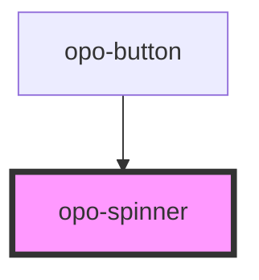

# opo-spinner

<!-- Auto Generated Below -->

## Properties

| Property     | Attribute    | Description                                                                                                        | Type                   | Default      |
| ------------ | ------------ | ------------------------------------------------------------------------------------------------------------------ | ---------------------- | ------------ |
| `decorative` | `decorative` | Hides the spinner from assistive technologies. Use it when another element already communicates the loading state. | `boolean`              | `false`      |
| `label`      | `label`      | Accessible label used when the spinner communicates loading by itself.                                             | `string`               | `"Cargando"` |
| `size`       | `size`       | Visual size of the spinner.                                                                                        | `"lg" \| "md" \| "sm"` | `"md"`       |

## Shadow Parts

| Part     | Description |
| -------- | ----------- |
| `"base"` |             |

## Dependencies

### Used by

 - [opo-button](../opo-button)

### Graph

----------------------------------------------

*Built with [StencilJS](https://stenciljs.com/)*
